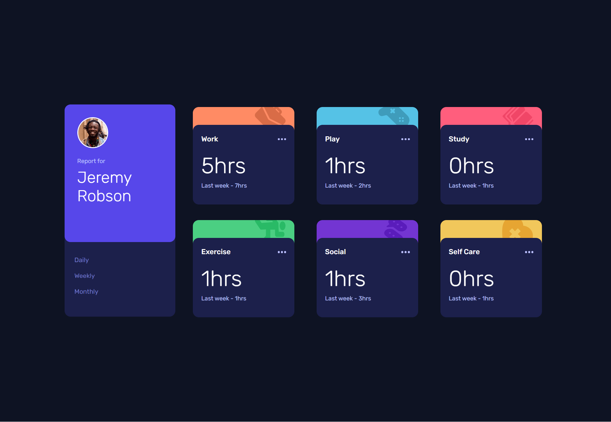

# Frontend Mentor - Solución de componentes de código QR

Esta es una solución al [desafío de panel de seguimiento de horas en Frontend Mentor](https://www.frontendmentor.io/challenges/time-tracking-dashboard-UIQ7167Jw). Los desafíos de Frontend Mentor te ayudan a mejorar tus habilidades de programación creando proyectos realistas.

## Tabla de contenido

- [Descripción general](#descripcion-general)
  - [Captura de pantalla](#captura-de-pantalla)
  - [Links](#links)
- [Mi proceso](#mi-proceso)
  - [Llevado a cabo con](#llevado-a-cabo-con)
  - [Lo que aprendí](#lo-que-aprendi)
  - [Desarrollo continuo](#desarrollo-continuo)
- [Autor](#autor)

## Descripción general

### Captura de pantalla

### Links
- [URL de la solución](https://www.frontendmentor.io/solutions/pgina-responsive-de-panel-de-tiempo-con-js-aXMqsFPf-l)
- [URL del sitio en vivo](https://braismarquez2025.github.io/braismarquez2025-time-tracking-dashboard-main/)

## Mi proceso

### Llevado a cabo con
- Marcado semántico HTML5
- Propiedades personalizadas de CSS
- Preprocesador SCSS
- Flexbox
- Grid
- Javascript

### Lo que aprendí
Me ha costado bastante iterar entre los contenedores "item" que he creado con js, ya que era necesario tanto para las imágenes como para el color del fondo del before. Otra cosa que me ha costado que quede bien es el grid en la resolución desktop, ya que los contenedores no ocupaban todo el espacio requerido, creándose márgenes gigantescos. Sobre todo el contenedor en el que cambias el tiempo (dia, semana o mes), ya que no se alineaba la altura con el grid, debido al before que contiene.

### Desarrollo continuo
Me ha motivado un montón este proyecto. Voy a seguir implentando javascript a los proyectos siguientes para mejorar en este lenguaje y subir mi nivel.

## Autor 
- Usuario de Frontend - [@braismarquez2025](https://www.frontendmentor.io/profile/braismarquez2025)
- Gmail - braismarquez2003@gmail.com

 
